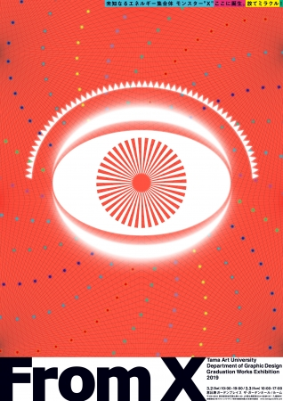

# Code of Poster Hackathon
## 1. Demo


## 2. Task
**来源**: [算法艺术实验室AALab](https://www.zhihu.com/people/lsdsuan-fa-yi-zhu-shi-yan-shi/activities)/[这周六北京Poster Hacker海报黑客 | 创意编程骇客颂](https://mp.weixin.qq.com/s?__biz=MjM5MDY3OTY5Mw==&mid=2649619633&idx=1&sn=4249442617df302054a58b20ea464e72&chksm=be584b53892fc24548b0bf1432157553110263ac7b55f6312c7b5db2f59a6539ce67b7a76ecf&mpshare=1&scene=1&srcid=0427qsXmhBGDXYo3wX9n8ZxS#rd)

**任务**: 4小时内把这幅海报做成动态海报    


## 3. Usage

按键功能:
 * `q`: 退出   
 * `e`: 隐藏中间的眼睛模板
 * `w`/`s`: 调大/调小圆圈半径
 * `a`/`d`: 顺时针/逆时针方向旋转


## 4. Requirement
```
pip install boxx
conda install opencv
```


